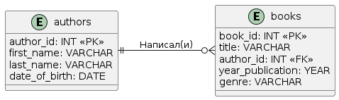

### Техническое задание (ТЗ)

#### Цель
Создать базу данных для хранения информации об авторах и их книгах, а также обеспечить возможность выборки книг по указанному автору.

### authors

| author_id | first_name | last_name   | date_of_birth |
|-----------|------------|-------------|---------------|
| 1         | Лев        | Толстой     | 1828-09-09    |
| 2         | Федор      | Достоевский | 1821-11-11    |
| 3         | Джоан      | Роулинг     | 1965-07-31    |

### books
| book_id | title                             | author_id | year_published | genre         |
|---------|-----------------------------------|-----------|----------------|---------------|
| 1       | Война и мир                       | 1         | 1869           | Роман         |
| 2       | Анна Каренина                     | 1         | 1877           | Роман         |
| 3       | Преступление и наказание          | 2         | 1866           | Роман         |
| 4       | Братья Карамазовы                 | 2         | 1880           | Философский   |
| 5       | Гарри Поттер и философский камень | 3         | 1997           | Фэнтези       |

### Сущности

1. **authors**
- **Описание**: Таблица для хранения информации об авторах.
- **Поля**:
    - `author_id`: INTEGER, PRIMARY KEY, уникальный идентификатор автора.
    - `first_name`: TEXT, NOT NULL, имя автора.
    - `last_name`: TEXT, NOT NULL, фамилия автора.
    - `date_of_birth`: TEXT, дата рождения автора в формате YYYY-MM-DD.

2. **books**
- **Описание**: Таблица для хранения информации о книгах.
- **Поля**:
    - `book_id`: INTEGER, PRIMARY KEY, уникальный идентификатор книги.
    - `title`: TEXT, NOT NULL, название книги.
    - `author_id`: INTEGER, ссылка на таблицу `authors` (внешний ключ).
    - `year_published`: INTEGER, год публикации книги.
    - `genre`: TEXT, жанр книги.

### Требуемые SQL-запросы

1. **Создание таблицы authors**
2. **Вставка данных в таблицу authors**
3. **Создание таблицы books**
4. **Вставка данных в таблицу books**
5. **Выборка всех данных из таблицы authors**
6. **Выборка всех данных из таблицы books**
7. **\* Выборка книг по указанному автору**

#### Ожидаемый результат
- Таблица `authors` должна содержать информацию об авторах: Лев Толстой, Федор Достоевский, Джоан Роулинг.
- Таблица `books` должна содержать информацию о книгах, связанных с указанными авторами.
- Должна быть возможность выполнять запросы для выборки всех авторов и книг.
- \* Должна быть возможность выполнять выборку книг по указанному автору (например, по фамилии автора).
