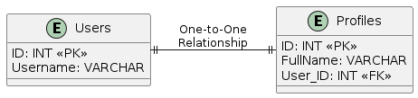
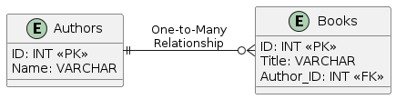
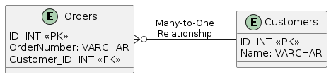
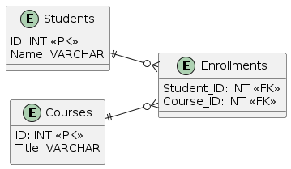

## Типы связей в базах данных
В реляционных базах данных связи между таблицами определяют, как данные из одной таблицы ассоциируются с данными из другой таблицы. Эти связи важны для структурирования и обеспечения целостности данных. Вот основные типы связей:

### Один к одному (One-to-One)
Пример отношения "Один к одному" (One-to-One) на основе таблицы с пользователями (Users) и их профилями (Profiles):

В этом примере:
- В таблице `Users` каждому пользователю соответствует ровно одна запись.
- В таблице `Profiles` каждому профилю также соответствует ровно одна запись.
- Поле `User_ID` в таблице `Profiles` является внешним ключом, указывающим на соответствующую запись в таблице `Users`.

Таблица `Users`:

| ID  | Username |
| --- | -------- |
| 1   | user1    |
| 2   | user2    |
| 3   | user3    |

Таблица `Profiles`:

| ID | FullName   | User_ID |
|----|------------|---------|
| 1  | John Doe   | 1       |
| 2  | Jane Smith | 2       |
| 3  | Alex Brown | 3       |

### Один ко многим (One-to-Many)
Пример отношения "Один ко многим" (One-to-Many) на основе таблицы с авторами книг (`Authors`) и их книгами (`Books`):

В этом примере:
- В таблице `Authors` каждому автору соответствует ровно одна запись.
- В таблице `Books` каждая книга связана с одним автором, указывая на его `ID` через внешний ключ `Author_ID`.
- У одного автора может быть много книг (один ко многим отношение), что отражается стрелкой от таблицы `Authors` к `Books`.
Вот пример таблиц с данными на основе диаграммы "Один ко многим" (One-to-Many):

Таблица `Authors`:

| ID | Name          |
|----|---------------|
| 1  | Leo Tolstoy   |
| 2  | Jane Austen   |
| 3  | Ernest Hemingway |

Таблица `Books`:

| ID | Title                  | Author_ID |
|----|------------------------|-----------|
| 1  | War and Peace          | 1         |
| 2  | Anna Karenina          | 1         |
| 3  | Pride and Prejudice    | 2         |
| 4  | Sense and Sensibility  | 2         |
| 5  | The Old Man and the Sea| 3         |

### Многие к одному (Many-to-One)
Пример отношения "Многие к одному" (Many-to-One) на основе таблицы с заказами (`Orders`) и их клиентами (`Customers`):

В этом примере:
- В таблице `Customers` каждому клиенту соответствует ровно одна запись.
- В таблице `Orders` каждый заказ связан с одним клиентом, указывая на его `ID` через внешний ключ `Customer_ID`.
- У одного клиента может быть много заказов (многие к одному отношение), что отражается стрелкой от таблицы `Orders` к `Customers`.

Таблица `Customers`:

| ID | Name         |
|----|--------------|
| 1  | John Smith   |
| 2  | Emily Brown  |
| 3  | Michael Johnson |

Таблица `Orders`:

| ID | OrderNumber | Customer_ID |
|----|-------------|-------------|
| 1  | ORD001      | 1           |
| 2  | ORD002      | 1           |
| 3  | ORD003      | 2           |
| 4  | ORD004      | 3           |
| 5  | ORD005      | 2           |

### Многие ко многим (Many-to-Many)
Вот пример отношения "Многие ко многим" (Many-to-Many) на основе таблицы с курсами (`Courses`) и их студентами (`Students`), реализованного через таблицу связи `Enrollments`:

В этом примере:
- В таблице `Students` хранятся данные о студентах, каждый из которых имеет уникальный `ID`.
- В таблице `Courses` хранятся данные о курсах, каждый из которых имеет уникальный `ID`.
- В таблице `Enrollments` хранятся связи между студентами и курсами. Она содержит два внешних ключа (`Student_ID` и `Course_ID`), которые связывают студентов с курсами, в которых они зарегистрированы.
- Отношение "Многие ко многим" между `Students` и `Courses` реализуется через таблицу `Enrollments`, которая позволяет одному студенту записаться на несколько курсов и каждый курс иметь несколько студентов.

Таблица `Students`:

| ID | Name         |
|----|--------------|
| 1  | Alice Brown  |
| 2  | Bob Smith    |
| 3  | Charlie Davis|

Таблица `Courses`:

| ID | Title                  |
|----|------------------------|
| 1  | Mathematics            |
| 2  | History                |
| 3  | Computer Science       |

Таблица `Enrollments` (таблица связи):

| Student_ID | Course_ID |
|------------|-----------|
| 1          | 1         | // Alice Brown enrolled in Mathematics
| 1          | 2         | // Alice Brown enrolled in History
| 2          | 2         | // Bob Smith enrolled in History
| 3          | 3         | // Charlie Davis enrolled in Computer Science
| 3          | 1         | // Charlie Davis enrolled in Mathematics
