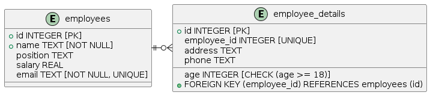

Требования к базе данных для системы управления сотрудниками:

1. **Таблица "employees"**:
   - Поля:
     - `id`: Уникальный идентификатор сотрудника (целое число, первичный ключ).
     - `name`: Имя сотрудника (текстовое поле, обязательное).
     - `position`: Должность сотрудника (текстовое поле).
     - `salary`: Заработная плата сотрудника (вещественное число).
     - `email`: Адрес электронной почты сотрудника (текстовое поле, обязательное, уникальное).

2. **Таблица "employee_details"**:
   - Поля:
     - `id`: Уникальный идентификатор деталей сотрудника (целое число, первичный ключ).
     - `employee_id`: Связь с таблицей "employees" через поле `id` (целое число, уникальное).
     - `address`: Адрес сотрудника (текстовое поле).
     - `phone`: Номер телефона сотрудника (текстовое поле).
     - `age`: Возраст сотрудника (целое число, с проверкой на возраст >= 18).

3. **Требования к функциональности**:
   - Обеспечение целостности данных: использование внешних ключей для связи таблицы "employee_details" с таблицей "employees".
   - Уникальность электронной почты: гарантировать, что каждый адрес электронной почты в таблице "employees" уникален.
   - Поддержка операций CRUD (создание, чтение, обновление, удаление) для управления информацией о сотрудниках.
   - Возможность расширения функциональности для внесения дополнительных данных о сотрудниках в будущем.

Эти требования обеспечат создание структуры базы данных для эффективного управления информацией о сотрудниках, поддерживая необходимые связи и обеспечивая целостность данных.
