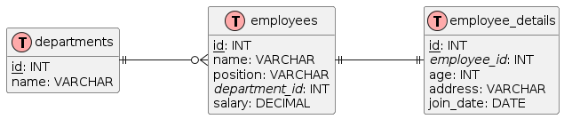

### Техническое задание на создание базы данных

#### 1. Введение
Цель данного технического задания — разработка базы данных для управления информацией о сотрудниках, отделах и деталях сотрудников. База данных должна включать три таблицы: `employees` (Сотрудники), `departments` (Отделы) и `employee_details` (Детали сотрудника). Также необходимо заполнить таблицы тестовыми данными.

#### 2. Требования к базе данных

##### 2.1. Таблица `departments` (Отделы)
- **id** (INT, PRIMARY KEY): Уникальный идентификатор отдела.
- **name** (TEXT): Название отдела.

##### 2.2. Таблица `employees` (Сотрудники)
- **id** (INT, PRIMARY KEY): Уникальный идентификатор сотрудника.
- **name** (TEXT): Имя сотрудника.
- **position** (TEXT): Должность сотрудника.
- **department_id** (INT, FOREIGN KEY): ID отдела, к которому принадлежит сотрудник.
- **salary** (DECIMAL): Зарплата сотрудника.

##### 2.3. Таблица `employee_details` (Детали сотрудника)
- **id** (INT, PRIMARY KEY): Уникальный идентификатор детали.
- **employee_id** (INT, FOREIGN KEY): ID сотрудника, к которому относится деталь.
- **age** (INT): Возраст сотрудника.
- **address** (TEXT): Адрес сотрудника.
- **join_date** (DATE): Дата принятия на работу.

#### 3. Связи между таблицами
- Таблица `departments` имеет отношение "один ко многим" с таблицей `employees` (один отдел может иметь много сотрудников).
- Таблица `employees` имеет отношение "один к одному" с таблицей `employee_details` (у каждого сотрудника есть одна запись с деталями).

#### 4. Требования к реализации
- База данных должна быть создана с использованием СУБД SQLite.
- Все таблицы должны быть созданы с учетом указанных типов данных и связей.
- Тестовые данные должны быть добавлены в таблицы после их создания.

#### 5. Ответственные лица
- Разработчик базы данных: ...
- Заказчик: ...
